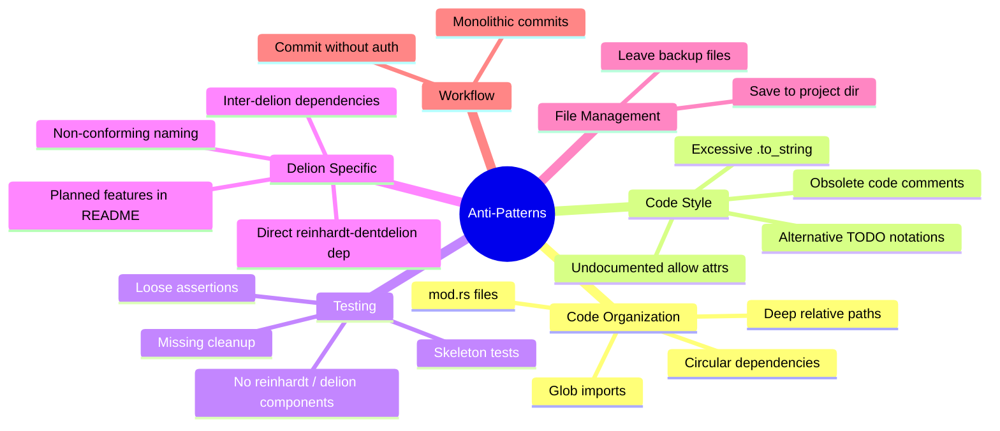

# Anti-Patterns and What NOT to Do

## Purpose

This document explicitly lists common mistakes, anti-patterns, and practices to
avoid in the awesome-delions project. Use this as a quick reference for code review
and development.

The following diagram provides a high-level overview of anti-pattern categories:



---

## Code Organization Anti-Patterns

### ❌ Using `mod.rs` Files

**DON'T:**

```
delions/auth-delion/src/handler/mod.rs  // ❌ Old Rust 2015 style
```

**DO:**

```
delions/auth-delion/src/handler.rs      // ✅ Rust 2024 style
```

**Why?** `mod.rs` is deprecated and makes file navigation harder. See
@instructions/MODULE_SYSTEM.md

### ❌ Glob Imports

**DON'T:**

```rust
pub use handler::*;  // ❌ Pollutes namespace
```

**DO:**

```rust
pub use handler::{AuthHandler, AuthConfig, HandlerError};  // ✅ Explicit
```

**Exception**: Test modules may use `use super::*;` for convenience:

```rust
#[cfg(test)]
mod tests {
    use super::*;  // ✅ Acceptable in test modules
}
```

**Why?** Makes it unclear what's exported and causes naming conflicts.

### ❌ Circular Module Dependencies

**DON'T:**

```rust
// module_a.rs
use crate::module_b::TypeB;  // ❌ A → B

// module_b.rs
use crate::module_a::TypeA;  // ❌ B → A (circular!)
```

**DO:**

```rust
// types.rs - Extract common types
pub struct TypeA;
pub struct TypeB;

// module_a.rs
use crate::types::{TypeA, TypeB};  // ✅ No cycle

// module_b.rs
use crate::types::{TypeA, TypeB};  // ✅ No cycle
```

**Why?** Causes compilation errors and indicates poor module design.

### ❌ Excessive Flat Structure

**DON'T:**

```
delions/auth-delion/src/
├── login_handler.rs       // ❌ Related files
├── login_config.rs        // scattered across
├── refresh_handler.rs     // the same level
├── refresh_config.rs
└── types.rs
```

**DO:**

```
delions/auth-delion/src/
├── login.rs               // ✅ Grouped by
├── login/                 // feature/domain
│   ├── handler.rs
│   └── config.rs
├── refresh.rs
└── refresh/
    ├── handler.rs
    └── config.rs
```

**Why?** Grouping related files improves maintainability and navigation.

### ❌ Deep Relative Paths

**DON'T:**

```rust
use super::super::super::utils;  // ❌ Confusing
```

**DO:**

```rust
use crate::utils::helpers;  // ✅ Absolute from crate root
use super::sibling_module;  // ✅ One level up is OK
```

**Why?** Deep relative paths are hard to understand and maintain.

---

## Code Style Anti-Patterns

### ❌ Excessive `.to_string()` Calls

**DON'T:**

```rust
fn format_scope(scope: &str) -> String {
    let label = format!("scope={}", scope.to_string());  // ❌ Unnecessary
    label.to_string()  // ❌ Already a String!
}
```

**DO:**

```rust
fn format_scope(scope: &str) -> String {
    format!("scope={}", scope)  // ✅ scope is already &str
}
```

**Why?** Unnecessary allocations hurt performance. Prefer borrowing.

### ❌ Leaving Obsolete Code

**DON'T:**

```rust
// fn old_handler_v1() {  // ❌ Commented out code
//     // ...
// }

pub fn handle(request: Request) -> Result<Response> {
    // ...
}
```

**DO:**

```rust
pub fn handle(request: Request) -> Result<Response> {  // ✅ Old code deleted
    // ...
}
```

**Why?** Git history preserves old code. Commented code creates clutter.

### ❌ Deletion Record Comments

**DON'T:**

```rust
// Removed old_handler - deprecated  // ❌ Don't document deletions
// Deleted: legacy_auth.rs (superseded)  // ❌ Git history has this

pub fn active_function() {
    // ...
}
```

**DO:**

```rust
pub fn active_function() {  // ✅ No deletion comments
    // ...
}
```

**Why?** Git history is the permanent record. Comments clutter the codebase.

### ❌ Using Alternative TODO Notations

**DON'T:**

```rust
// Implementation Note: This needs to be completed    // ❌ Custom notation
// FIXME: Add validation                              // ❌ Use TODO instead
// NOTE: Not implemented yet                          // ❌ NOTE is for info only
```

**DO:**

```rust
// TODO: Implement refresh-token rotation policy
fn rotate_refresh_token(token: &RefreshToken) {
    todo!("Rotation policy planned for next sprint")
}

// Or for intentionally omitted features:
fn legacy_v1_login() {
    unimplemented!("v1 login flow is intentionally not supported")
}
```

**Why?** Standardized notation (`TODO`, `todo!()`, `unimplemented!()`) is
searchable and clear.

**CI Enforcement:**

The TODO Check CI workflow and Semgrep rules in `.semgrep/todo-comments.yml`
automatically detect `// TODO`, `// FIXME`, and `todo!()` macros added in pull
requests. PRs introducing new unresolved TODOs will fail the CI check.
Only `unimplemented!()` (for permanently excluded features) is permitted.

Additionally, Clippy enforces the following deny lints:
- `clippy::todo` - prevents `todo!()` macros
- `clippy::unimplemented` - prevents `unimplemented!()` macros (use `#[allow(clippy::unimplemented)]` with comment for intentional exclusions)
- `clippy::dbg_macro` - prevents `dbg!()` macros

### ❌ Unmarked Placeholder Implementations

**DON'T:**

```rust
pub fn get_delion_config() -> DelionConfig {
    DelionConfig::default()  // ❌ Looks like production code!
}

pub fn emit_event(event: &Event) -> Result<()> {
    println!("Would emit: {event:?}");  // ❌ Mock without marker
    Ok(())
}
```

**DO:**

```rust
pub fn get_delion_config() -> DelionConfig {
    todo!("Implement delion configuration loading from reinhardt settings")
}

pub fn emit_event(event: &Event) -> Result<()> {
    // TODO: Integrate with reinhardt event bus
    println!("Would emit: {event:?}");
    Ok(())
}
```

**Why?** Unmarked placeholders can be mistaken for production code.

### ❌ Undocumented `#[allow(...)]` Attributes

**DON'T:**

```rust
// No explanation why this is allowed
#[allow(dead_code)]
struct ReservedField {
	future_field: Option<String>,  // ❌ Why is this unused?
}
```

**DO:**

```rust
// Reserved for future config fields planned in the next delion version.
// These fields will be populated once the reinhardt facade exposes the
// corresponding feature flag.
#[allow(dead_code)]
struct ExtendedConfig {
	scaling_policy: Option<ScalingPolicy>,  // Will be used in future
}
```

**Why?** `#[allow(...)]` attributes suppress important compiler warnings. Every
suppression must be justified with a clear comment explaining:
- **For future implementation**: What will use it and when
- **For macro requirements**: Which macro needs it and why
- **For test code**: What test pattern requires it
- **For Clippy rules**: Why the rule doesn't apply here

---

## Delion-Specific Anti-Patterns

### ❌ Direct Dependency on `reinhardt-dentdelion`

**DON'T:**

```toml
# delions/auth-delion/Cargo.toml
[dependencies]
reinhardt-dentdelion = "0.1"  # ❌ Bypasses the facade
```

**DO:**

```toml
# delions/auth-delion/Cargo.toml
[dependencies]
reinhardt = { version = "0.1", default-features = false, features = ["dentdelion"] }
```

**Why?** The `reinhardt` facade is the single, versioned entry point every delion
consumes. Taking a direct `reinhardt-dentdelion` dependency couples the delion to
an internal crate whose API, versioning, and feature surface is not part of the
public contract. See @instructions/DELION_PATTERNS.md (DP-2).

### ❌ Inter-Delion Dependencies

**DON'T:**

```toml
# delions/admin-delion/Cargo.toml
[dependencies]
auth-delion = { path = "../auth-delion" }  # ❌ Delions must not depend on each other
```

**DO:**

If two delions need shared behavior, promote it into the `reinhardt` facade (or
an underlying reinhardt crate) and consume it from both delions via the facade.

**Why?** Delions are independent plugin crates that must be releasable, testable,
and publishable on their own. Inter-delion dependencies break that contract. See
@instructions/DELION_PATTERNS.md (DP-4).

### ❌ Non-Conforming Delion Names

**DON'T:**

```
delions/auth/                 # ❌ Missing `-delion` suffix
delions/AuthDelion/           # ❌ Not kebab-case
delions/auth_delion/          # ❌ snake_case is not allowed
```

**DO:**

```
delions/auth-delion/          # ✅ kebab-case + `-delion` suffix
delions/session-delion/
delions/audit-log-delion/
```

**Why?** The `xxx-delion` convention is what makes the project discoverable (e.g.,
via crates.io search, release-plz per-crate tags `auth-delion@vX.Y.Z`) and
matches the `cargo generate` template. See @instructions/DELION_PATTERNS.md
(DP-1, DP-5, DP-8).

---

## Testing Anti-Patterns

### ❌ Skeleton Tests

Tests without meaningful assertions that always pass.

**Why?** Tests must be capable of failing. See @instructions/TESTING_STANDARDS.md TP-1
for detailed examples.

### ❌ Tests Without Delion or reinhardt Components

Tests that only verify standard library or third-party behavior.

**Why?** Every test must exercise at least one delion or reinhardt facade
component. See @instructions/TESTING_STANDARDS.md TP-2.

### ❌ Tests Without Cleanup

Tests that create files/resources without cleaning up.

**Why?** Test artifacts must be cleaned up. See @instructions/TESTING_STANDARDS.md TI-3
for cleanup techniques.

### ❌ Global State Tests Without Serialization

Tests modifying global state without `#[serial]` attribute.

**Why?** Global state tests can conflict if run in parallel. See
@instructions/TESTING_STANDARDS.md TI-4 for serial test patterns.

### ❌ Loose Assertions

Using `contains()`, range checks, or loose pattern matching instead of exact
value assertions.

**Why?** Loose assertions can pass with incorrect values. See
@instructions/TESTING_STANDARDS.md TI-5 for assertion strictness guidelines and
acceptable exceptions.

### ❌ Tests Without Clear AAA Structure

Tests that mix setup, execution, and verification without clear phase separation,
or use non-standard phase labels (`// Setup`, `// Execute`, `// Verify`).

**Why?** Clear Arrange-Act-Assert structure improves test readability and
maintainability. See @instructions/TESTING_STANDARDS.md TI-6.

---

## File Management Anti-Patterns

### ❌ Saving Files to Project Directory

**DON'T:**

```bash
./generate-template.sh > output.txt   # ❌ Saved to project root
```

**DO:**

```bash
./generate-template.sh > /tmp/output.txt   # ✅ Use /tmp

# Delete when done
rm /tmp/output.txt
```

**Why?** Keeps project directory clean. Prevents accidental commits.

### ❌ Leaving Backup Files

**DON'T:**

```bash
ls
handler.rs
handler.rs.bak        # ❌ Backup file left behind
config.rs.old         # ❌ Old version not deleted
```

**DO:**

```bash
# Clean up immediately
rm handler.rs.bak config.rs.old  # ✅ Delete backups
```

**Why?** Backup files clutter the codebase and can be accidentally committed.

---

## Workflow Anti-Patterns

### ❌ Committing Without User Instruction

**DON'T:**

```bash
# ❌ AI creates commit automatically
git add .
git commit -m "feat: Add feature"
```

**DO:**

```bash
# ✅ Wait for explicit user instruction
# User: "Please commit these changes"
git add <specific files>
git commit -m "..."
```

**Why?** Commits should only be made with explicit user authorization (or Plan
Mode approval — see @instructions/COMMIT_GUIDELINE.md CE-1).

### ❌ Monolithic Commits

**DON'T:**

```bash
# ❌ One huge commit for entire feature
git add .
git commit -m "feat(auth-delion): Implement full auth flow"
# Changes: handler, config, tests, examples, docs...
```

**DO:**

```bash
# ✅ Split into specific intents
git add delions/auth-delion/src/handler.rs
git commit -m "feat(auth-delion): add login handler entry point"

git add delions/auth-delion/src/config.rs
git commit -m "feat(auth-delion): add configuration struct with validation"

git add delions/auth-delion/tests/handler_tests.rs
git commit -m "test(auth-delion): add login handler tests"
```

**Why?** Small, focused commits make history easier to understand and review.

---

## Documentation Anti-Patterns

### ❌ Outdated Documentation After Code Changes

Always update documentation in the same workflow as code changes.

**Why?** Documentation must be updated with code changes in the same workflow.

### ❌ Planned Features in README

**DON'T:**

```markdown
<!-- delions/auth-delion/README.md -->

### Planned Features

- OAuth backend support
- Token refresh rotation
```

**DO:**

```rust
//! delions/auth-delion/src/lib.rs
//!
//! ## Planned Features
//!
//! - OAuth backend support
//! - Token refresh rotation
```

**Why?** Planned features belong in `lib.rs`, README shows implemented features only.

---

## Related Documentation

- **Main Quick Reference**: @CLAUDE.md (see Quick Reference section)
- **Main standards**: @CLAUDE.md
- **Module system**: @instructions/MODULE_SYSTEM.md
- **Testing standards**: @instructions/TESTING_STANDARDS.md
- **Documentation standards**: @instructions/DOCUMENTATION_STANDARDS.md
- **Delion patterns**: @instructions/DELION_PATTERNS.md
