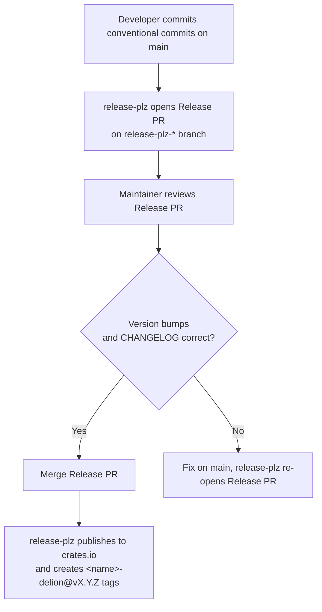

# Delion Patterns

## Purpose

This file defines delion plugin patterns for the awesome-delions project. These rules ensure consistent, release-ready delion crates across the workspace, and clarify the boundaries between a delion, the `reinhardt` facade, and the underlying `reinhardt-dentdelion` plugin framework.

A **delion** is an independent plugin crate for the reinhardt web framework, published to crates.io on its own cadence. Each delion is discoverable (via the `xxx-delion` naming convention), composable (via feature flags on the `reinhardt` facade), and releasable independently (via release-plz per-crate tagging).

---

## Delion Structure

### DP-1 (MUST): Delion Directory Layout

Every delion MUST live under `delions/<name>-delion/` in the workspace and MUST be an independent crate with its own `Cargo.toml`, `src/`, `README.md`, `CHANGELOG.md`, and `dentdelion.toml`.

**Required layout:**

```
delions/auth-delion/
├── Cargo.toml
├── README.md
├── CHANGELOG.md
├── dentdelion.toml
└── src/
    └── lib.rs
```

**Rules:**
- The crate name MUST match the directory name (e.g., `delions/auth-delion/` → `name = "auth-delion"`)
- MUST use `xxx-delion` kebab-case naming (see DP-5)
- MUST inherit `edition`, `license`, `repository`, `authors` from `[workspace.package]` via `.workspace = true`
- MUST include `src/**`, `README.md`, `LICENSE-MIT`, `LICENSE-APACHE`, `CHANGELOG.md` in the `[package.include]` array (required for crates.io publication)
- MUST declare `[lints] workspace = true` to inherit workspace-level `unsafe_code = "forbid"` and Clippy settings
- The workspace `[workspace] members = ["delions/*"]` pattern automatically picks up new delions — do not hand-register them

---

## Dependency Policy

### DP-2 (MUST): Depend on the `reinhardt` Facade, Not `reinhardt-dentdelion`

Delions MUST consume reinhardt functionality through the `reinhardt` facade crate with explicit feature flags. Direct dependencies on `reinhardt-dentdelion` (or any other internal reinhardt crate) are **forbidden**.

**DO:**

```toml
[dependencies]
reinhardt = { version = "0.1.0-alpha", default-features = false, features = ["dentdelion"] }
```

**DON'T:**

```toml
[dependencies]
reinhardt-dentdelion = "0.1"              # ❌ Bypasses the facade
reinhardt = { version = "*" }             # ❌ Wildcard version
reinhardt = { path = "../../reinhardt" }  # ❌ Local path dependency
```

**Why?**
- The `reinhardt` facade is the single, versioned public surface of the reinhardt ecosystem; its feature flags define what is "stable for delion consumption"
- A direct `reinhardt-dentdelion` dependency couples the delion to an internal crate whose API and feature surface are not part of the public contract
- A `path` dependency breaks publishability and release-plz version detection

**Adding feature flags:**

```toml
[dependencies]
reinhardt = { version = "0.1.0-alpha", default-features = false, features = ["dentdelion", "auth", "database"] }
```

Always pin the `reinhardt` version to a published release. Upgrades must go through a normal commit (`chore(deps): bump reinhardt from 0.1 to 0.2`) and trigger a delion release if appropriate.

---

## Feature Flag Hygiene

### DP-3 (SHOULD): Minimal Feature Surface

Each delion's own `[features]` block SHOULD expose the minimum set of feature flags required by its public API. The default feature set SHOULD avoid enabling heavy optional dependencies.

**Guidelines:**
- Prefer narrow, purpose-named features (`oauth`, `prometheus`, `tracing`) over broad categories
- Do NOT re-export `reinhardt` facade features through the delion's own feature set — consumers should enable them on `reinhardt` directly
- Document each feature in the delion's `README.md` and `lib.rs` module docs

**Example:**

```toml
# delions/auth-delion/Cargo.toml
[features]
default = []
oauth = ["dep:oauth2"]
tracing = ["dep:tracing"]

[dependencies]
reinhardt = { version = "0.1.0-alpha", default-features = false, features = ["dentdelion"] }
oauth2 = { version = "4", optional = true }
tracing = { version = "0.1", optional = true }
```

---

## Inter-Delion Boundary

### DP-4 (MUST): No Inter-Delion Dependencies

Delions MUST NOT depend on other delions. `delions/a-delion` MUST NOT declare `b-delion` as a dependency via path, git, or crates.io.

**Why?** Each delion is a standalone plugin with its own release cadence, feature set, and consumer base. Inter-delion dependencies would:

- Couple release schedules (one delion's breaking change forces every dependent delion to bump)
- Break release-plz per-crate version detection
- Create surprise transitive feature flags for end users
- Defeat the "plug and play" promise of the delion ecosystem

**What to do instead:** When two delions need shared behavior, promote it into the `reinhardt` facade (or one of its underlying crates) and consume the new facade feature from both delions. See @instructions/UPSTREAM_ISSUE_REPORTING.md for the upstream proposal workflow and @instructions/ISSUE_HANDLING.md (WU-3) for the cross-delion fix workflow.

**DON'T:**

```toml
# delions/admin-delion/Cargo.toml
[dependencies]
auth-delion = { path = "../auth-delion" }           # ❌ Path
auth-delion = { version = "0.1" }                   # ❌ Via crates.io
auth-delion = { git = "https://..." }               # ❌ Via git
```

---

## Template-Based Creation

### DP-5 (MUST): Use the cargo-generate Template

New delions MUST be created using the repository's `cargo-generate` template. This guarantees consistent metadata, file layout, and `dentdelion.toml` structure.

**Command:**

```bash
cargo generate --path template/ --name <name>-delion --destination delions/
```

**Rules:**
- The project name passed to `--name` MUST end with `-delion` and be kebab-case (see DP-1)
- Do NOT hand-create delion crates by copying an existing one — the template is the single source of truth for new-crate structure
- After generation, fill in the `description` placeholder meaningfully; do NOT leave template placeholders

**Generated structure (current template):**

```
delions/<name>-delion/
├── Cargo.toml              # Inherits workspace package fields
├── README.md               # Delion-specific overview
├── CHANGELOG.md            # Managed by release-plz
├── dentdelion.toml         # Plugin manifest: name, version, description, capabilities
└── src/
    └── lib.rs              # Entry point with module-level docs
```

### DP-6 (MUST): `dentdelion.toml` Plugin Manifest

Every delion MUST ship a `dentdelion.toml` plugin manifest. The plugin `name` in `dentdelion.toml` MUST match the crate name in `Cargo.toml`.

**Required shape:**

```toml
[plugin]
name = "auth-delion"
version = "0.1.0"
description = "Authentication delion for the reinhardt framework"
capabilities = []
```

**Rules:**
- `name` MUST match `[package].name` in `Cargo.toml` exactly
- `version` MUST match `[package].version` — release-plz bumps both in sync; do NOT hand-edit in a feature branch
- `capabilities` declares what the delion provides to the reinhardt runtime; add entries only when the delion actually exposes that capability

---

## Public API Boundary

### DP-7 (MUST): Explicit Public API via `pub use`

Delion crates MUST expose a deliberate public API using explicit `pub use` re-exports at the module entry point. Glob imports are forbidden outside of test modules (see @instructions/MODULE_SYSTEM.md and @instructions/ANTI_PATTERNS.md).

**Example:**

```rust
// delions/auth-delion/src/lib.rs

//! # auth-delion
//!
//! Authentication delion for the reinhardt framework.

mod config;
mod handler;

// Public API — explicit re-exports only
pub use config::{AuthConfig, AuthConfigError};
pub use handler::{AuthHandler, AuthOutcome};
```

**Rules:**
- Internal types (errors, builders, state) not intended for external consumption MUST remain private
- Breaking the public API (removing or renaming a `pub use` item) requires a `!` commit marker or `BREAKING CHANGE:` footer (see @instructions/COMMIT_GUIDELINE.md)

---

## Release Integration

### DP-8 (MUST): Align Changes with Per-Crate Release Tags

release-plz releases each delion independently, using tags of the form `<name>-delion@vX.Y.Z` (see `release-plz.toml`). Changes MUST be scoped so that each delion's commit history on `main` produces a clean, release-plz-interpretable version bump.

**Rules:**
- A single PR SHOULD modify exactly one delion (see @instructions/ISSUE_HANDLING.md WU-1)
- Commit scopes MUST match the delion crate name or a recognized workspace scope (e.g., `feat(auth-delion): ...`, `chore(workspace): ...`) — see @instructions/COMMIT_GUIDELINE.md
- A delion's `Cargo.toml` `version` and `dentdelion.toml` `version` MUST move together; never hand-edit either in a feature branch
- `pr_branch_prefix` in `release-plz.toml` MUST remain `"release-plz-"` — do NOT change it

**Release workflow recap:**



---

## Quick Reference

### ✅ MUST DO
- Place every delion under `delions/<name>-delion/` with the full required layout (DP-1)
- Use `reinhardt` facade with explicit feature flags as the only reinhardt dependency (DP-2)
- Keep the delion's own feature surface minimal and purpose-named (DP-3)
- Refuse inter-delion dependencies; promote shared behavior to the `reinhardt` facade instead (DP-4)
- Create new delions with `cargo generate --path template/` (DP-5)
- Ship a `dentdelion.toml` whose `name`/`version` match `Cargo.toml` (DP-6)
- Expose a deliberate public API via `pub use` (DP-7)
- Scope PRs and commits so release-plz produces clean per-delion version bumps (DP-8)

### ❌ NEVER DO
- Depend directly on `reinhardt-dentdelion` or any internal reinhardt crate (DP-2)
- Use wildcard or `path`-based `reinhardt` dependencies (DP-2)
- Re-export reinhardt facade features through a delion's own feature set (DP-3)
- Declare another delion as a dependency (DP-4)
- Hand-create a delion by copying an existing one (DP-5)
- Hand-edit `Cargo.toml` / `dentdelion.toml` `version` in a feature branch (DP-6, DP-8)
- Expose internal types through glob re-exports (DP-7)
- Change `pr_branch_prefix` in `release-plz.toml` (DP-8)

---

## Related Documentation

- **Main Quick Reference**: @CLAUDE.md (see Quick Reference section)
- **Main Standards**: @CLAUDE.md
- **Module System**: @instructions/MODULE_SYSTEM.md
- **Anti-Patterns**: @instructions/ANTI_PATTERNS.md
- **Testing Standards**: @instructions/TESTING_STANDARDS.md
- **Commit Guidelines**: @instructions/COMMIT_GUIDELINE.md
- **Issue Handling**: @instructions/ISSUE_HANDLING.md
- **Upstream Issue Reporting**: @instructions/UPSTREAM_ISSUE_REPORTING.md
- **release-plz configuration**: `release-plz.toml`
- **cargo-generate template**: `template/`
