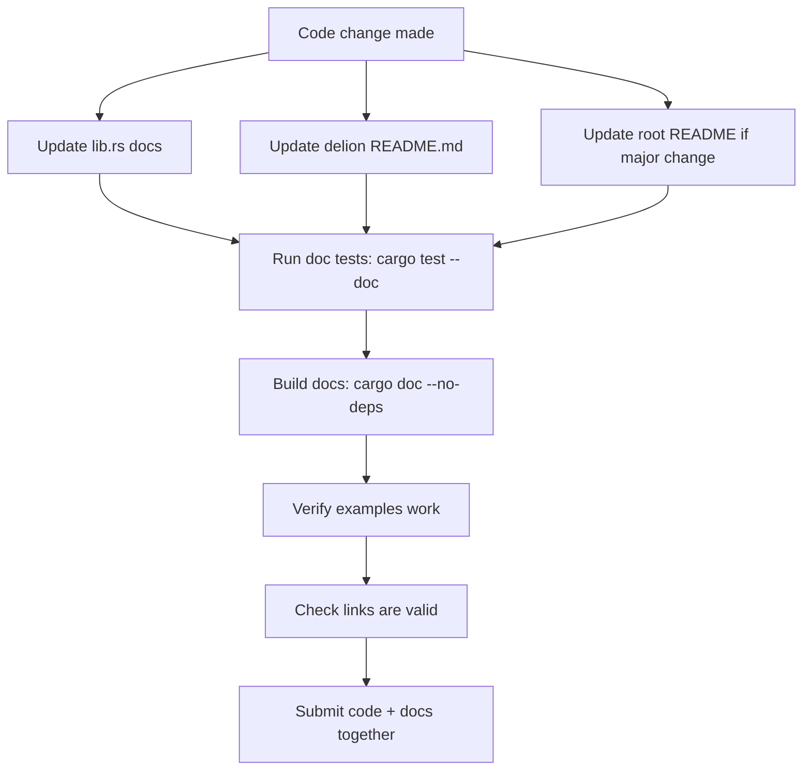
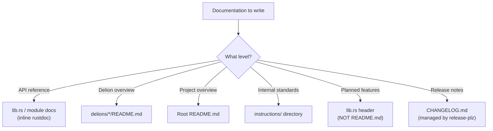

# Documentation Standards

## Purpose

This document defines documentation maintenance standards for the awesome-delions project, ensuring documentation stays synchronized with code changes.

---

## Core Principles

### DM-1 (MUST): Documentation Updates with Code Changes

**ALWAYS** update relevant documentation when implementing or modifying features.

**Documentation updates MUST be done in the same workflow as the code changes.**

**DO NOT** leave documentation outdated after code modifications.

**Example Workflow:**
```
1. Implement feature in the delion
2. Update relevant docs in the SAME session
3. Verify docs match implementation
4. Submit both code and docs together
```

The following diagram summarizes the documentation update workflow:



---

## Documentation Locations

### DM-2 (MUST): Documentation Locations

When modifying features, check and update the following documentation as applicable:

#### Project-Level Documentation
**File:** `README.md` (workspace root)
**Contents:**
- Project overview
- Installation instructions
- Quick start guide
- Main features (implemented only)
- Basic usage examples
- Links to detailed documentation

**When to Update:**
- Adding a new delion to the workspace
- Changing the delion naming convention or repository structure
- Updating the cargo-generate template workflow
- Updating workspace-level dependencies

#### Delion-Level Documentation

**File:** `delions/<name>-delion/README.md`
**Contents:**
- Delion-specific overview
- Feature flags exposed through the reinhardt facade
- Usage examples
- API highlights

**File:** `delions/<name>-delion/src/lib.rs`
**Contents:**
- Module documentation (`//!`)
- Planned features section (see DM-6)
- Architecture overview
- Code examples

**File:** `delions/<name>-delion/CHANGELOG.md`
- Maintained automatically by release-plz
- Do NOT hand-edit except when release-plz requires a manual backfill

#### Internal Standards
**Location:** `instructions/` directory (this file and its siblings)
**When to Update:**
- Adding new workspace-wide conventions
- Changing established patterns
- Adding new standards or conventions

The following diagram illustrates where different types of documentation should be placed:



---

## Documentation Consistency

### DM-3 (MUST): Documentation Consistency

Ensure consistency across all documentation levels (project, delion, lib.rs).

**Consistency Checklist:**
- [ ] Terminology is consistent across all docs
- [ ] Code examples use the same style
- [ ] Version numbers match
- [ ] Links are valid and point to correct locations
- [ ] Examples actually work with current code
- [ ] API signatures match implementation

---

## Documentation Scope

### DM-4 (SHOULD): Documentation Scope

Update documentation for new features, modified features, deprecated features, and removed features. See examples in the workflow section for specific patterns.

---

## Documentation Quality

### DM-5 (MUST): Documentation Quality

Ensure high-quality documentation:

#### Examples Must Work
All code examples in documentation must be tested and working.

**Use Doc Tests:**
```rust
/// Handle an incoming authentication request.
///
/// # Examples
///
/// ```rust,no_run
/// use auth_delion::AuthHandler;
///
/// let handler = AuthHandler::default();
/// let _ = handler.health_check();
/// ```
pub fn handle(request: Request) -> Result<Response> {
    // ...
}
```

**Test Documentation:**
```bash
cargo test --doc  # Runs all doc tests
```

---

## Planned Features Location

### DM-6 (MUST): Planned Features Location

**Planned Features MUST be documented in the delion's `lib.rs` file header.**

**DO NOT include Planned Features sections in README.md files.**

**Format in `lib.rs`:**
```rust
//! # auth-delion
//!
//! Authentication delion for the reinhardt framework.
//!
//! ## Features
//!
//! - Login handler with configurable TTL ✅
//! - Refresh token support ✅
//!
//! ## Planned Features
//!
//! - OAuth backend support
//! - Passwordless (magic link) authentication
//!
//! ## Examples
//!
//! ```rust,no_run
//! // Example code
//! ```
```

**Why?**
- Keeps planned features close to implementation code
- Better visibility during development
- README focuses on what's available NOW
- Reduces user confusion about what's actually implemented

---

## Rustdoc Formatting Standards

### DM-7 (MUST): Rustdoc Formatting Standards

Doc comments (`///` and `//!`) are processed by rustdoc and must follow specific formatting rules to avoid warnings and ensure proper HTML generation.

#### RD-1: Generic Types Must Be Wrapped in Backticks

Generic types like `<T>` are interpreted as HTML tags by rustdoc. Always wrap them in backticks.

```rust
// ✅ CORRECT
/// Returns `Option<String>` for the result
/// Uses `Result<T, Error>` for fallible operations

// ❌ INCORRECT (causes "unclosed HTML tag" warnings)
/// Returns Option<String> for the result
/// Uses Result<T, Error> for fallible operations
```

**Common types requiring backticks:**
- `Option<T>`, `Result<T, E>`, `Vec<T>`, `Box<T>`
- `Arc<T>`, `Rc<T>`, `RefCell<T>`, `Mutex<T>`
- `HashMap<K, V>`, `HashSet<T>`, `BTreeMap<K, V>`
- `Pin<T>`, `Future<Output = T>`, `Stream<Item = T>`

#### RD-2: Macro Attributes Must Be Wrapped in Backticks

Attributes like `#[derive]` are interpreted as markdown links by rustdoc. Always wrap them in backticks.

```rust
// ✅ CORRECT
/// Apply `#[delion]` to mark a struct as a delion entry point
/// Use `#[tokio::test]` for async test functions

// ❌ INCORRECT (causes "unresolved link" warnings)
/// Apply #[delion] to mark a struct as a delion entry point
```

#### RD-3: URLs Must Be Wrapped in Angle Brackets or Backticks

```rust
// ✅ CORRECT
/// See <https://github.com/kent8192/awesome-delions> for source

// ❌ INCORRECT (causes "bare URL" warnings)
/// See https://github.com/kent8192/awesome-delions for source
```

#### RD-4: Code Blocks Must Specify Language

````rust
// ✅ CORRECT
/// ```rust
/// let x = 42;
/// ```
///
/// ```toml
/// [dependencies]
/// reinhardt = { version = "0.1", features = ["dentdelion"] }
/// ```

// ❌ INCORRECT (may cause warnings)
/// ```
/// let x = 42;
/// ```
````

#### RD-5: Bracket Patterns Must Be Wrapped in Backticks

```rust
// ✅ CORRECT
/// Access the first claim via `claims[0]`

// ❌ INCORRECT (causes "unresolved link" warnings)
/// Access the first claim via claims[0]
```

#### RD-6: Feature-Gated Items Must Use Backticks (Not Intra-Doc Links)

```rust
// ✅ CORRECT (works regardless of enabled features)
/// Enable the `oauth` feature to use `OAuthBackend`

// ❌ INCORRECT (causes "unresolved link" warnings when feature disabled)
/// Enable the `oauth` feature to use [`OAuthBackend`]
```

#### Quick Reference Table

| Pattern | Incorrect | Correct |
|---------|-----------|---------|
| Generic types | `Option<T>` | `` `Option<T>` `` |
| Attributes | `#[derive]` | `` `#[derive]` `` |
| URLs | `https://...` | `<https://...>` or `` `https://...` `` |
| Code blocks | ` ``` ` | ` ```rust ` |
| Array access | `arr[0]` | `` `arr[0]` `` |
| Feature-gated items | `` [`TypeName`] `` | `` `TypeName` `` |

#### Verification

```bash
cargo doc --workspace --all-features 2>&1 | grep "warning:"
```

All doc comments should produce zero warnings.

---

## Diagram Standards

### DM-8 (SHOULD): Use Mermaid for Architecture Diagrams

When documenting architecture, data flow, or relationships between components,
**prefer Mermaid diagrams over ASCII art**.

#### Setup

Add `aquamarine` as a dependency in the delion's `Cargo.toml`:

```toml
[dependencies]
aquamarine = "0.5"
```

#### Usage

```rust
#[cfg_attr(doc, aquamarine::aquamarine)]
/// Handler lifecycle:
///
/// ```mermaid
/// stateDiagram-v2
///     [*] --> Idle: handler created
///     Idle --> Handling: request received
///     Handling --> Responding: request processed
///     Responding --> Idle: response sent
///     Handling --> Failed: error occurred
///     Failed --> Idle: error reported
/// ```
pub struct AuthHandler { }
```

#### When to Keep ASCII Art

- Simple inline diagrams (1-2 lines)
- Terminal output examples
- Code structure illustrations where text alignment matters

---

## Documentation Workflow

### Standard Documentation Update Process

```
1. ✅ Implement the code
2. ✅ Update lib.rs documentation
3. ✅ Update delion README.md if needed
4. ✅ Update root README.md if major change
5. ✅ Run doc tests: cargo test --doc
6. ✅ Build docs: cargo doc --no-deps --open
7. ✅ Verify examples work
8. ✅ Check links are valid
9. ✅ Submit code + docs together
```

### Documentation Review Checklist

Before submitting:

- [ ] All relevant documentation files updated
- [ ] Code examples tested and working
- [ ] API signatures match implementation
- [ ] Terminology consistent across all docs
- [ ] Links are valid
- [ ] Formatting is correct
- [ ] No outdated information
- [ ] Planned features in lib.rs, not README
- [ ] Migration guides for breaking changes
- [ ] Doc tests pass
- [ ] Rustdoc warnings: zero (see DM-7)

---

## Prohibited Content

### DM-9 (MUST): Do Not Document User Requests or AI Interactions

- Documentation must describe technical reasons, design decisions, and implementation details
- Avoid phrases like "User requested...", "As requested by...", "User asked..."
- Focus on the "why" (technical rationale), not the "who asked"

---

## Related Documentation

- **Main Quick Reference**: @CLAUDE.md (see Quick Reference section)
- **Main standards**: @CLAUDE.md
- **Module system**: @instructions/MODULE_SYSTEM.md
- **Testing standards**: @instructions/TESTING_STANDARDS.md
- **Anti-patterns**: @instructions/ANTI_PATTERNS.md
- **Delion patterns**: @instructions/DELION_PATTERNS.md
