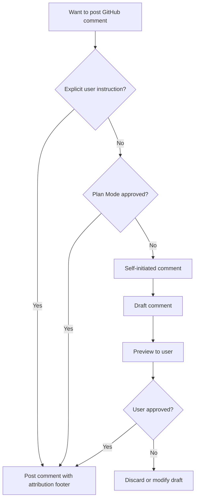

# GitHub Interaction Guidelines

## Purpose

This file defines the policy for Claude Code to participate in GitHub discussions on existing pull requests and issues in the awesome-delions project. These rules ensure appropriate authorization, consistent formatting, and useful technical context when commenting on PRs and Issues.

---

## Language Requirements

### LR-1 (MUST): English-Only Comments

- **ALL** comments on PRs and Issues MUST be written in English
- Code references, file paths, and technical terms should use their original form
- This ensures accessibility for international contributors and maintainers

**Rationale:**
- Consistent with LR-1 in PR_GUIDELINE.md and ISSUE_GUIDELINES.md
- GitHub is an international platform
- English is the lingua franca of software development

---

## Posting Policy

### PP-1 (MUST): Posting Authorization Flow

Claude Code MUST follow this authorization model before posting any comment:

| Authorization Source | Action |
|---------------------|--------|
| Explicit user instruction | Post directly |
| Plan Mode approval | Post directly |
| Self-initiated (no instruction) | MUST preview and get user confirmation |

**Self-Initiated Comment Flow:**

1. Draft the comment content
2. Present the full preview to the user
3. Wait for explicit approval
4. Post only after confirmation

The following diagram summarizes the comment authorization decision flow:



### PP-2 (MUST): Content Preview Before Posting

Before posting any self-initiated comment:

1. Show the complete comment text to the user
2. Identify the target (PR number, Issue number, review thread)
3. Explain why this comment would be helpful
4. Wait for explicit approval or modification request

**Example Preview Format:**
```
Target: PR #42 - Review comment reply
Thread: delions/auth-delion/src/handler.rs line 15

---
[Comment content here]
---

Shall I post this comment?
```

### PP-3 (MUST): Use GitHub MCP or CLI for Posting

- **MUST** prefer GitHub MCP tools for posting comments when available
- **Fallback**: Use GitHub CLI (`gh`) when GitHub MCP is not available
- **NEVER** use raw `curl` or web browser for posting comments

**GitHub CLI Fallback:**
```bash
# Comment on a PR
gh pr comment <number> --body "Comment text"

# Comment on an issue
gh issue comment <number> --body "Comment text"

# Review a PR
gh pr review <number> --comment --body "Review comment"
```

---

## PR Review Response

### RR-1 (MUST): Responding to Review Comments

When responding to PR review comments:

1. Address the specific concern raised by the reviewer
2. Reference the exact code location being discussed
3. Provide technical justification for implementation decisions
4. Offer alternatives when the reviewer suggests changes

### RR-2 (SHOULD): Response Content Structure

Use this template for PR review responses:

```markdown
**Re: [Reviewer's concern summary]**

[Direct answer to the concern]

[Technical justification or explanation]

[Code reference if applicable]:
`path/to/file.rs:L42` - [Description of relevant code]

[Action taken or proposed]:
- [What was changed, or what will be changed]

🤖 Generated with [Claude Code](https://claude.com/claude-code)
```

### RR-3 (MUST): Code Reference Format

When referencing code in GitHub comments:

- **MUST** use repository-relative paths: `delions/auth-delion/src/handler.rs`
- **MUST** include line numbers when referring to specific code: `delions/auth-delion/src/handler.rs:L42`
- **MUST** use markdown code blocks with language specifiers for code snippets
- **NEVER** use absolute local paths (`/Users/...`, `/home/...`)

**Examples:**
```markdown
✅ Good: See `delions/auth-delion/src/handler.rs:L150`
✅ Good: The implementation in `delions/auth-delion/src/config.rs:L42-L58`
❌ Bad: See `/Users/kent8192/Projects/awesome-delions/delions/auth-delion/src/handler.rs`
❌ Bad: Check line 150 (no file reference)
```

---

## PR Implementation Context

### PIC-1 (SHOULD): Providing Change Context for Reviewers

When providing implementation context on PRs, include:

```markdown
## Implementation Context

**Approach:** [Brief description of the approach taken]

**Key Changes:**
- `delions/auth-delion/src/handler.rs` - [What was changed and why]
- `delions/auth-delion/src/config.rs` - [What was changed and why]

**Design Decisions:**
- [Decision 1]: [Rationale]
- [Decision 2]: [Rationale]

**Testing:**
- [What was tested and how]
- [Edge cases covered]

🤖 Generated with [Claude Code](https://claude.com/claude-code)
```

### PIC-2 (SHOULD): Impact Analysis Comments

When changes affect multiple delions, provide impact analysis (note: inter-delion
dependencies are prohibited — see @instructions/DELION_PATTERNS.md DP-4 — so the
analysis usually covers multiple independent delions sharing a release window):

```markdown
## Impact Analysis

**Changed Delions:**
| Delion | Change Type | Impact |
|--------|-------------|--------|
| `auth-delion` | API addition | Non-breaking |
| `session-delion` | Behavior change | Breaking (see migration) |

**Consumer Notes:**
- Applications depending on `auth-delion` do not need changes
- Applications depending on `session-delion` must update session store usage

**Migration Required:** [Yes/No]
- [Migration steps if applicable]

🤖 Generated with [Claude Code](https://claude.com/claude-code)
```

---

## Copilot Review Handling

### CR-1 (MUST): Automated Review Response Policy

When GitHub Copilot posts review comments on a PR created by Claude Code:

1. **Authorization**: Plan Mode approval or explicit user instruction to create a PR implicitly authorizes handling Copilot review comments
2. **No additional user confirmation** is needed to resolve Copilot review conversations
3. **Code fixes** resulting from valid Copilot suggestions follow normal commit policy

### CR-2 (MUST): Evaluation Criteria for Copilot Suggestions

Evaluate each Copilot suggestion against:

| Criterion | Accept | Reject |
|-----------|--------|--------|
| Code correctness | Fixes a real bug or logic error | False positive or misunderstanding |
| Project conventions | Aligns with CLAUDE.md and instructions/ | Contradicts project standards |
| Security | Addresses a genuine vulnerability | Overly paranoid for internal code |
| Performance | Measurable improvement | Premature optimization |
| Readability | Genuinely improves clarity | Style preference with no clear benefit |

### CR-3 (MUST): Resolution Protocol

- **Accepted suggestions**: Fix the code → commit → resolve the conversation
- **Rejected suggestions**: Resolve the conversation (reply with brief technical justification only if the suggestion represents a common misconception that future reviewers might also raise)
- **All conversations MUST be resolved** before the PR is considered complete

---

## Issue Discussion

### ID-1 (MUST): Issue Comment Guidelines

When commenting on issues:

1. **Stay on topic** — address the specific issue being discussed
2. **Be actionable** — provide information that helps resolve the issue
3. **Reference code** — link to relevant source code using repository-relative paths
4. **Avoid noise** — do not post comments that add no value (e.g., "+1", "same here")

### ID-2 (SHOULD): Implementation Context for Issues

When providing implementation context for issue discussion:

```markdown
## Technical Analysis

**Current Behavior:**
[Description of current behavior with code references]

**Root Cause:**
[Analysis of why the issue occurs]
- `delions/auth-delion/src/handler.rs:L42` - [Relevant code explanation]

**Proposed Solution:**
[Description of proposed fix or implementation]

**Affected Components:**
- [Component 1]: [How it's affected]
- [Component 2]: [How it's affected]

**Estimated Scope:** [Small/Medium/Large]
- Files to modify: [count]
- Tests to add/update: [count]

🤖 Generated with [Claude Code](https://claude.com/claude-code)
```

---

## GitHub Discussions

### GD-1 (SHOULD): Discussions vs Issues

Use GitHub Discussions for:
- Usage questions and how-to inquiries
- Ideas and brainstorming
- General community discussion

Use Issues for:
- Bug reports with reproduction steps
- Feature requests with clear requirements
- Documentation errors
- Performance issues with benchmarks

**Discussion URL:** https://github.com/kent8192/awesome-delions/discussions

### GD-2 (SHOULD): Redirecting Questions

When encountering question-type Issues that are better suited for Discussions:
- Politely suggest GitHub Discussions as a more appropriate venue
- Provide the Discussions URL
- Follow PP-1 authorization policy before posting redirect comments

---

## Agent Context Provision

### AC-1 (SHOULD): Structured Context for Coding Agents

When providing context for external coding agents on Issues or PRs, use structured formats that are easily parseable by both humans and machines.

### AC-2 (SHOULD): Agent Context Template

```markdown
## Agent Context

### Task
- **Type:** [Bug Fix | Feature | Refactor | Test | Docs]
- **Scope:** [Affected delion(s) and module(s)]
- **Priority:** [Critical | High | Medium | Low]

### Entry Points
| File | Symbol | Description |
|------|--------|-------------|
| `delions/auth-delion/src/handler.rs` | `AuthHandler` | Primary handler entry point |
| `delions/auth-delion/src/config.rs` | `AuthConfig` | Configuration struct |

### Reference Implementations
- Pattern to follow: `delions/session-delion/src/handler.rs`
- Test pattern: `delions/session-delion/tests/handler_tests.rs`

### Project Constraints
- **Module system:** Rust 2024 edition (`module.rs` + `module/` directory, NO `mod.rs`)
- **Testing:** `rstest` framework with Arrange-Act-Assert pattern
- **Comments:** English only
- **Dependencies:** `reinhardt` facade with feature flags ONLY — NEVER `reinhardt-dentdelion` directly
- **Inter-delion dependencies:** Prohibited

### Acceptance Criteria
- [ ] [Criterion 1 — verifiable statement]
- [ ] [Criterion 2 — verifiable statement]
- [ ] All existing tests pass (`cargo nextest run --workspace`)
- [ ] Clippy clean (`cargo clippy --workspace -- -D warnings`)
- [ ] Format clean (`cargo fmt --all -- --check`)

### Files NOT to Modify
- `Cargo.toml` version fields (managed by release-plz)
- `CHANGELOG.md` files (managed by release-plz)
- `.github/workflows/` (CI configuration)

🤖 Generated with [Claude Code](https://claude.com/claude-code)
```

---

## Content Guidelines

### CG-1 (MUST): What to Include

- Technical explanations and justifications
- Code references with repository-relative paths and line numbers
- Relevant error messages or log output (wrapped in `<details>` if long)
- Links to related issues, PRs, or documentation
- Structured data (tables, lists) for complex information

### CG-2 (MUST): What to Avoid

- **User requests or AI interaction details** — never mention "user asked me to..." or "I was instructed to..."
- **Absolute local paths** — never include `/Users/...`, `/home/...`, or other machine-specific paths
- **Sensitive information** — never include credentials, tokens, API keys, or private configuration
- **Unfolded long output** — wrap long logs, stack traces, or code blocks in `<details>` tags

```markdown
<details>
<summary>Full error output</summary>

\`\`\`
[long output here]
\`\`\`

</details>
```

- **Speculation without evidence** — state uncertainty explicitly
- **Non-actionable comments** — every comment should provide value or move discussion forward

---

## Footer Format

### FF-1 (MUST): Claude Code Attribution

All GitHub comments posted by Claude Code MUST include the following footer:

```markdown
🤖 Generated with [Claude Code](https://claude.com/claude-code)
```

**Rules:**
- Place at the very end of the comment
- Separate from content with one blank line
- Do NOT include `Co-Authored-By` in comments (that is for commits only)

---

## Quick Reference

### ✅ MUST DO

- Get authorization before posting (explicit instruction or Plan Mode approval)
- Preview self-initiated comments and wait for user confirmation
- Write ALL comments in English
- Use GitHub MCP tools or CLI for posting
- Include Claude Code attribution footer on all comments
- Use repository-relative paths for code references
- Include line numbers when referencing specific code
- Use markdown code blocks with language specifiers
- Wrap long output in `<details>` tags
- Stay on topic and be actionable
- Wait for Copilot review after PR creation and handle all comments
- Evaluate Copilot suggestions against project conventions before accepting
- Resolve all Copilot review conversations before considering PR complete

### ❌ NEVER DO

- Post comments without authorization (explicit instruction or Plan Mode approval)
- Post self-initiated comments without previewing and getting confirmation
- Include absolute local paths (`/Users/...`, `/home/...`)
- Include user requests or AI interaction details in comments
- Include sensitive information (credentials, tokens, API keys)
- Post non-actionable or noise comments ("+1", "same here")
- Skip Claude Code attribution footer
- Post vague comments without code references or technical detail
- Use raw `curl` for GitHub operations when MCP or CLI is available
- Reference code without file path and line number

---

## Related Documentation

- **Pull Request Guidelines**: @instructions/PR_GUIDELINE.md
- **Issue Guidelines**: @instructions/ISSUE_GUIDELINES.md
- **Commit Guidelines**: @instructions/COMMIT_GUIDELINE.md
- **Documentation Standards**: @instructions/DOCUMENTATION_STANDARDS.md
- **Main Quick Reference**: @CLAUDE.md (see Quick Reference section)

---

**Note**: This document focuses on commenting and interacting with existing PRs and Issues. For creating PRs, see @instructions/PR_GUIDELINE.md. For creating Issues, see @instructions/ISSUE_GUIDELINES.md.
