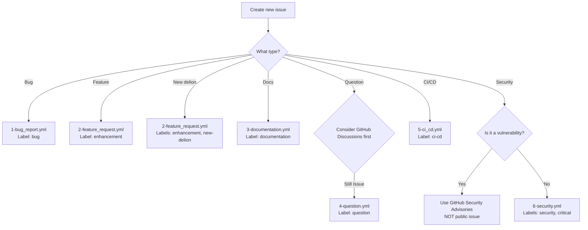
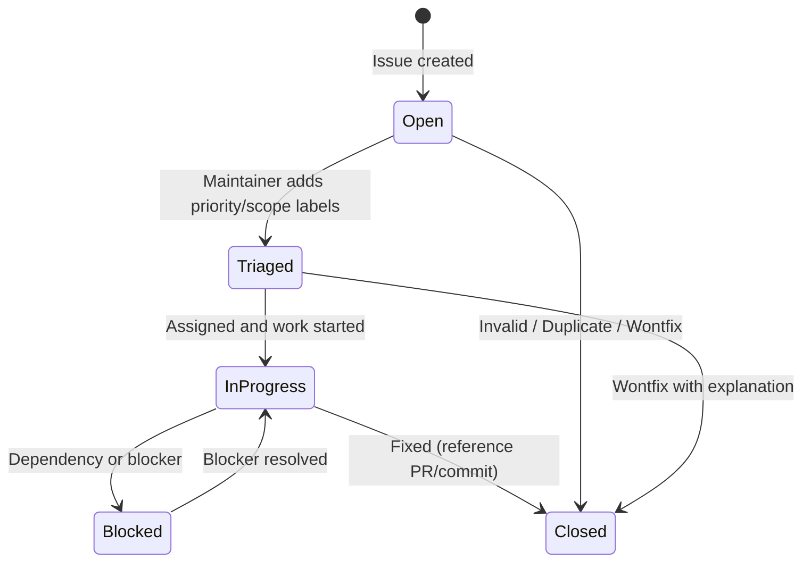

# Issue Guidelines

## Purpose

This file defines the issue policy for the awesome-delions project. These rules ensure clear issue tracking, proper labeling, and consistent issue management.

---

## Language Requirements

### LR-1 (MUST): English-Only Content

**ALL issue titles, descriptions, and comments MUST be written in English.**

- Issue titles MUST be in English
- Issue descriptions MUST be in English
- All comments within issues MUST be in English
- Code examples and error messages may use their original language

**Rationale:** English ensures accessibility for all contributors and maintainers worldwide.

---

## Issue Creation Policy

### IC-1 (MUST): Use GitHub Tools

Issues MUST be created using:
- GitHub Web Interface
- GitHub CLI (`gh issue create`)
- GitHub MCP server

**Example (GitHub CLI):**
```bash
gh issue create --title "Bug: auth-delion panics on empty refresh-token" --body "Description..."
```

### IC-2 (MUST): Search Before Creating

**ALWAYS** search existing issues before creating a new one:
1. Search open and closed issues
2. Check if the issue has already been reported
3. Review related issues for context

**Example:**
```bash
gh issue list --search "refresh-token panic"
gh issue list --state closed --search "auth-delion"
```

### IC-3 (MUST): Use Issue Templates

Issues MUST be created using the appropriate issue template from `.github/ISSUE_TEMPLATE/`:

| Issue Type | Template File | Label Applied |
|------------|--------------|---------------|
| Bug report | `.github/ISSUE_TEMPLATE/1-bug_report.yml` | `bug` |
| Feature request | `.github/ISSUE_TEMPLATE/2-feature_request.yml` | `enhancement` |
| Documentation | `.github/ISSUE_TEMPLATE/3-documentation.yml` | `documentation` |
| Question | `.github/ISSUE_TEMPLATE/4-question.yml` | `question` |
| CI/CD | `.github/ISSUE_TEMPLATE/5-ci_cd.yml` | `ci-cd` |
| Security | `.github/ISSUE_TEMPLATE/6-security.yml` | `security`, `critical` |

**CLI Template Usage:**

When creating issues via `gh issue create`, GitHub CLI does not automatically apply templates like the Web UI. Read the appropriate template file from `.github/ISSUE_TEMPLATE/` and include its structure in your `--body` content.

**Note:** For security vulnerabilities, ALWAYS use GitHub Security Advisories instead of public issues. The `6-security.yml` template is only for non-vulnerability security discussions.

The following diagram illustrates the template selection decision tree:



---

## Issue Title Format

### IT-1 (MUST): Clear and Descriptive

Issue titles MUST be:
- **Specific**: Clearly describe the problem or request
- **Concise**: Maximum 72 characters for readability
- **Uppercase Start**: Begin with uppercase letter
- **Professional**: Use technical language

**Examples:**

| Type | Example Title |
|------|---------------|
| Bug | `Bug: auth-delion panics on empty refresh-token` |
| Feature | `Feature: Add OAuth backend support to auth-delion` |
| New delion | `Feature: Add audit-log-delion for structured audit logging` |
| Documentation | `Docs: Missing usage example for session-delion config` |
| CI/CD | `CI: Integration tests failing on nightly toolchain` |
| Security | `Security: Evaluate token storage best practices` |
| Question | `Question: How to combine auth-delion and session-delion?` |

**Title Quality:**

- ❌ Bad: "Fix bug" (too vague)
- ❌ Bad: "performance issue" (unclear what)
- ❌ Bad: "add feature" (which feature?)
- ✅ Good: "Bug: auth-delion panics on empty refresh-token"
- ✅ Good: "Feature: Add OAuth backend support to auth-delion"

---

## Issue Labels

The canonical list of labels is defined in `.github/labels.yml`. Labels referenced below MUST exist in that file.

### IL-1 (MUST): Apply Type Labels

**ALL issues MUST have at least one type label:**

| Label | Description |
|-------|-------------|
| `bug` | Confirmed bug or unexpected behavior |
| `enhancement` | New feature or improvement request |
| `documentation` | Documentation issues or improvements |
| `question` | Questions about usage or implementation |
| `performance` | Performance-related issues |
| `ci-cd` | CI/CD workflow issues |
| `security` | Security vulnerabilities or concerns |
| `new-delion` | Adding a new delion crate (in addition to `enhancement`) |

### IL-2 (SHOULD): Apply Priority and Scope Labels

**Priority Labels:**

| Label | Description |
|-------|-------------|
| `critical` | Blocks release or major functionality |
| `high` | Important fix or feature |
| `medium` | Normal priority |
| `low` | Minor fix or enhancement |

**Scope Labels (awesome-delions specific):**

| Label | Description |
|-------|-------------|
| `plugin-api` | Plugin API, trait definitions |
| `wasm` | WASM plugin support |
| `template` | cargo-generate template changes |
| `breaking-change` | Breaking changes that require migration |

**Status Labels:**

| Label | Description |
|-------|-------------|
| `good first issue` | Suitable for new contributors |
| `help wanted` | Community contributions welcome |
| `duplicate` | Duplicate of another issue |
| `invalid` | Not a valid issue |
| `wontfix` | Will not be fixed (intentional) |
| `needs more info` | Awaiting additional information |

### IL-3 (MUST): Agent-Detected Issue Labels

Issues created by LLM agent bug discovery MUST include the `agent-suspect` label.

**Rules:**
- ALL agent-detected issues MUST have `agent-suspect` label at creation
- The label is removed ONLY after independent verification confirms the issue
- Independent verification requires a separate agent (with independent context) or human review
- The verifying entity MUST NOT have participated in the initial detection

**Setup note:** The `agent-suspect` label must exist in `.github/labels.yml`. If it does not, add it before first use.

### IL-4 (MUST): Upstream Tracking Issue Labels

Tracking issues created for upstream dependency bugs MUST include the `upstream-tracking` label.

**Rules:**
- ALL awesome-delions tracking issues for upstream bugs MUST have `upstream-tracking` label at creation
- The tracking issue title MUST follow the format: `Upstream: [brief description] (reinhardt-web#N)`
- The tracking issue MUST reference the upstream issue URL
- Close the tracking issue when the upstream issue is resolved AND any awesome-delions workaround is removed

See @instructions/UPSTREAM_ISSUE_REPORTING.md (UR-4) for the full cross-referencing workflow.

**Setup note:** The `upstream-tracking` label must exist in `.github/labels.yml`. If it does not, add it before first use.

### IL-5 (NEVER): Reserved Labels

Do NOT apply the following labels to Issues manually:

| Label | Why reserved |
|-------|--------------|
| `release` | Applied automatically by release-plz to Release PRs; never valid on Issues |

---

## Issue Lifecycle

### LC-1 (MUST): Triage Process

**New Issues:**

1. **Automatic Labeling**: Issue template applies type label
2. **Maintainer Review**: Triage within 48 hours
3. **Label Enhancement**: Add priority and scope labels
4. **Assignment**: Assign to maintainer or contributor

The following diagram shows the issue lifecycle state transitions:



### LC-2 (MUST): Issue Hygiene

**Issue Closure:**

- **Fixed**: Close with comment describing fix and referencing PR/commit
- **Duplicate**: Close with reference to original issue
- **Wontfix**: Close with explanation of why it won't be fixed
- **Invalid**: Close with explanation

---

## Security Issues

### SEC-1 (MUST): Private Disclosure

**Security vulnerabilities MUST be reported privately:**

1. **DO NOT** create public issues for security vulnerabilities
2. **DO** use GitHub Security Advisories for private reporting

**How to Report:**

Via GitHub Security Advisories (Recommended):
```
https://github.com/kent8192/awesome-delions/security/advisories
```

---

## Quick Reference

### ✅ MUST DO

- Write ALL issue content in English (no exceptions)
- Search existing issues before creating new ones
- Use appropriate issue templates for ALL issues
- Apply at least one type label to every issue
- Report security vulnerabilities privately via GitHub Security Advisories
- Provide minimal reproduction code for bug reports
- Include environment details (Rust version, reinhardt version, OS)
- Be specific in issue titles (max 72 characters)
- Apply `agent-suspect` label to all agent-detected bug issues
- Verify agent-detected bugs independently before removing `agent-suspect` label
- Report upstream reinhardt-web issues immediately upon discovery (see @instructions/UPSTREAM_ISSUE_REPORTING.md)
- Add `new-delion` label (alongside `enhancement`) when proposing a new delion crate

### ❌ NEVER DO

- Create public issues for security vulnerabilities
- Create duplicate issues without searching first
- Skip issue templates when creating issues
- Use non-English in issue titles or descriptions
- Create issues without appropriate labels
- Apply `release` label to issues (reserved for release-plz PRs)
- Submit bug reports without reproduction steps
- Leave issues inactive without response
- Remove `agent-suspect` label without independent verification

---

## Related Documentation

- **Pull Request Guidelines**: @instructions/PR_GUIDELINE.md
- **Issue Handling Principles**: @instructions/ISSUE_HANDLING.md
- **Upstream Issue Reporting**: @instructions/UPSTREAM_ISSUE_REPORTING.md
- **Commit Guidelines**: @instructions/COMMIT_GUIDELINE.md
- **Label Definitions**: `.github/labels.yml`

---

**Note**: This document focuses on issue creation and management. For pull request guidelines, see @instructions/PR_GUIDELINE.md.
