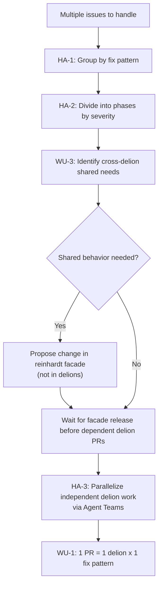
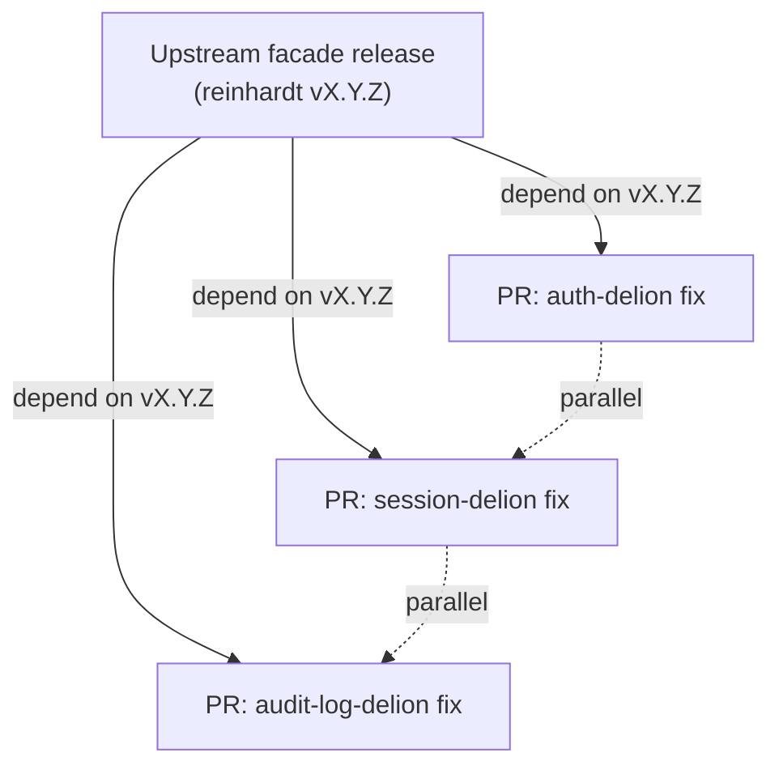

# Issue Handling Principles

## Purpose

This file defines strategic principles for handling multiple issues efficiently. While @instructions/ISSUE_GUIDELINES.md covers individual issue creation and management, this document provides workflow-level guidance for planning, batching, and parallelizing issue resolution across the awesome-delions project's multi-delion workspace.

---

## Handling Approach

The following diagram summarizes the batch issue processing workflow:



### HA-1 (SHOULD): Fix Pattern Batch Processing

Group issues by fix pattern (the technique or approach used to resolve them) and process them as a batch.

**Rationale:** When multiple issues require the same type of fix (e.g., error handling improvement, dependency update, doc comment fix), addressing them together reduces context-switching overhead and ensures consistency.

**Example:**

| Fix Pattern | Issues |
|-------------|--------|
| Error handling | #101 (auth-delion panic), #103 (session-delion nil), #107 (audit-log-delion missing error context) |
| Rustdoc formatting | #102 (generic types), #105 (missing backticks) |
| Dependency update | #104 (outdated reinhardt), #106 (vulnerable third-party crate) |

**Application:**
1. Categorize open issues by their fix approach
2. Identify common patterns that span multiple issues
3. Address each pattern group as a cohesive work unit

### HA-2 (SHOULD): Phase Division by Severity

Divide batch work into phases ordered by severity and exploitability, addressing the most critical issues first.

**Phase Example:**

| Phase | Severity | Description | Issues |
|-------|----------|-------------|--------|
| Phase 1 | Critical | Actively exploitable vulnerabilities or production crashes | #101, #103 |
| Phase 2 | High | Significant risk but harder to exploit | #107, #102 |
| Phase 3 | Medium | Important improvements | #104, #105, #106 |

### HA-3 (SHOULD): Agent Team Parallel Work

Use Agent Teams to parallelize work across independent delions within the same phase.

**Rationale:** Since inter-delion dependencies are prohibited (@instructions/DELION_PATTERNS.md DP-4), fixes in different delions are inherently independent and can be implemented simultaneously by different agents.

**Prerequisites for parallelization:**
- Fixes are in separate delions with no shared code changes required
- No preceding change in the `reinhardt` facade is needed
- Each agent can complete its work independently

**Example:**
```
Phase 1 (parallel work):
  Agent A → auth-delion (fix #101)
  Agent B → session-delion (fix #103)
  Agent C → audit-log-delion (fix #107)
```

### HA-4 (MUST): Branch Organization

Organize work into branches with descriptive names. Each work unit MUST produce logically grouped PRs.

**Branch naming:**
```
<type>/<description>

Examples:
fix/auth-delion-refresh-panic
fix/session-delion-timeout-handling
docs/rustdoc-formatting-sweep
```

**Rules:**
- One branch per logical work unit (see WU-1)
- Branch names MUST NOT include internal metadata such as phase numbers, agent states, or workflow identifiers
- Branch names MUST be descriptive and understandable to other developers without project-specific context
- Branches may contain multiple commits if they follow commit guidelines (@instructions/COMMIT_GUIDELINE.md)

---

## Work Unit Principles

### WU-1 (MUST): Basic Work Unit

**1 PR = 1 delion × 1 fix pattern** is the basic work unit for batch issue handling.

**Rationale:** This granularity ensures PRs are focused, reviewable, and independently mergeable. It also aligns with release-plz per-delion versioning — one delion's fix should not trigger unrelated delion releases.

**Examples:**

| PR | Delion | Fix Pattern | Issues Addressed |
|----|--------|-------------|------------------|
| PR #1 | auth-delion | Error handling | #101 |
| PR #2 | session-delion | Error handling | #103 |
| PR #3 | audit-log-delion | Error handling | #107 |

### WU-2 (SHOULD): Same-Delion Combination

Related issues within the same delion MAY be combined into a single PR when they share context or the fixes are interrelated.

**When to combine:**
- Fixes touch the same files or modules
- One fix naturally addresses another issue
- Fixes are tightly related (e.g., two rustdoc formatting issues in the same module)

**When NOT to combine:**
- Fixes are in different modules with no shared context
- Combining would make the PR too large (>400 lines)
- Fixes are for different severity levels

### WU-3 (MUST): Cross-Delion Shared Behavior

When batch fixes require shared behavior across delions, the shared change MUST NOT live in one delion and be path-depended by the others (see @instructions/DELION_PATTERNS.md DP-4). Instead:

1. Propose the shared behavior upstream in the `reinhardt` facade / an underlying reinhardt crate (see @instructions/UPSTREAM_ISSUE_REPORTING.md)
2. Wait for the facade change to be released
3. Update each delion to consume the new facade feature independently

**Rationale:** awesome-delions is a collection of independent plugin crates. Shared behavior must live in their common dependency (the `reinhardt` facade), not in a sibling delion.

**Rules:**
- Shared behavior MUST live in the `reinhardt` facade or one of its underlying crates, never in another delion
- Per-delion PRs MUST reference the upstream facade version they depend on
- Never duplicate shared logic across delions instead of promoting it upstream

The following diagram illustrates the WU-3 dependency structure:



---

## Workflow Example

**Scenario:** 6 issues identified across 3 delions.

**Step 1: Categorize by fix pattern (HA-1)**

| Fix Pattern | Issues | Delions Affected |
|-------------|--------|------------------|
| Error handling | #101, #103, #107 | auth-delion, session-delion, audit-log-delion |
| Rustdoc formatting | #102, #105 | auth-delion, session-delion |
| Dependency update | #104 | (workspace-level) |

**Step 2: Divide into phases by severity (HA-2)**

| Phase | Issues | Fix Pattern |
|-------|--------|-------------|
| Phase 1 | #101, #103, #107 | Error handling (critical) |
| Phase 2 | #102, #105 | Rustdoc formatting (high) |
| Phase 3 | #104 | Dependency update (medium) |

**Step 3: Identify cross-delion shared needs (WU-3)**

Phase 1 requires a shared structured error type. Because inter-delion dependencies
are prohibited, propose it in the `reinhardt` facade instead.

**Step 4: Execute Phase 1**

```
Upstream: propose structured error types in reinhardt facade
  → reinhardt release vX.Y.Z lands on crates.io

Commits (parallel via Agent Team, HA-3), each depending on reinhardt vX.Y.Z:
  "fix(auth-delion): adopt reinhardt structured error types"       → PR #B
  "fix(session-delion): adopt reinhardt structured error types"    → PR #C
  "fix(audit-log-delion): adopt reinhardt structured error types"  → PR #D
```

---

## Upstream Issue Reporting

When issues in upstream dependencies (e.g., reinhardt-web) are discovered during awesome-delions development, they MUST be reported immediately to the upstream repository. See **@instructions/UPSTREAM_ISSUE_REPORTING.md** for the full policy, including:

- Immediate reporting requirement (UR-1)
- GitHub CLI usage with `-R` flag (UR-2)
- Cross-referencing between awesome-delions and upstream issues (UR-4)
- Workaround policy (WP-1, WP-2)

---

## Quick Reference

### ✅ MUST DO
- Use 1 PR = 1 delion × 1 fix pattern as the basic work unit (WU-1)
- Promote shared behavior to the `reinhardt` facade before depending on it across delions (WU-3)
- Use descriptive branch names without internal metadata (HA-4)
- Release and consume the facade change before dependent delion PRs (WU-3)
- Report upstream issues in reinhardt-web immediately upon discovery (UR-1)

### ❌ NEVER DO
- Mix changes to unrelated delions in a single issue-fix PR
- Mix unrelated fix patterns in a single PR
- Introduce a direct inter-delion path dependency to share code
- Duplicate shared logic across delions instead of promoting it to the facade
- Delay reporting upstream issues discovered during awesome-delions development
- Implement workarounds without creating an upstream issue first

---

## Related Documentation

- **Issue Guidelines**: @instructions/ISSUE_GUIDELINES.md
- **Upstream Issue Reporting**: @instructions/UPSTREAM_ISSUE_REPORTING.md
- **Pull Request Guidelines**: @instructions/PR_GUIDELINE.md
- **Commit Guidelines**: @instructions/COMMIT_GUIDELINE.md
- **GitHub Interaction**: @instructions/GITHUB_INTERACTION.md
- **Delion Patterns**: @instructions/DELION_PATTERNS.md

---

**Note**: This document provides strategic guidance for batch issue handling. For individual issue creation and management, see @instructions/ISSUE_GUIDELINES.md. For PR formatting and review process, see @instructions/PR_GUIDELINE.md.
