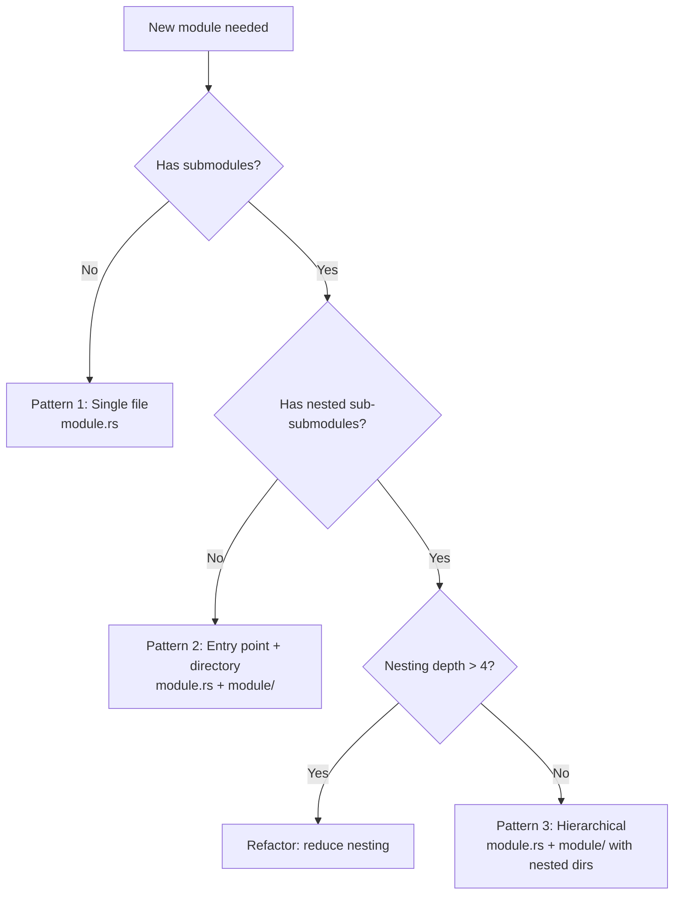

# Rust 2024 Edition Module System Standards

## Purpose

This document defines the module system standards for the awesome-delions project using Rust 2024 Edition conventions.

## Core Principle

**MUST USE `module.rs` + `module/` directory structure (Rust 2024 Edition)**

**NEVER USE `mod.rs` files** (Rust 2015/2018 deprecated pattern)

---

## Basic Patterns

The following diagram helps select the appropriate module pattern:



### Pattern 1: Small Module (Single File)

For modules with no submodules:

```
src/
├── lib.rs          // mod utils;
└── utils.rs        // pub fn helper() {}
```

### Pattern 2: Medium Module (With Submodules)

For modules with submodules:

```
src/
├── lib.rs          // mod handler;
├── handler.rs      // pub mod request; pub mod response;
└── handler/
    ├── request.rs
    └── response.rs
```

**Key Points:**
- `handler.rs` is the entry point
- Declare submodules in `handler.rs`: `pub mod request; pub mod response;`
- Parent declares with: `mod handler;` in `lib.rs`

### Pattern 3: Large Module (Hierarchical Structure)

For complex modules with nested submodules:

```
src/
├── lib.rs             // mod api;
├── api.rs             // pub mod endpoints; pub mod middleware;
└── api/
    ├── endpoints.rs   // pub mod users; pub mod sessions;
    ├── endpoints/
    │   ├── users.rs
    │   └── sessions.rs
    ├── middleware.rs
    └── middleware/
        └── auth.rs
```

**Key Points:**
- Each level has an entry point file (`api.rs`, `endpoints.rs`, `middleware.rs`)
- Submodules declared in their parent's entry point
- Avoid nesting beyond 4 levels

---

## Visibility and Encapsulation

### Controlling Public API with `pub use`

Use `pub use` in module entry points to control what's exposed:

```rust
// handler.rs (entry point)
mod request;        // Private submodule
mod response;       // Private submodule

// Public API - explicitly re-export
pub use request::{Request, RequestBuilder};
pub use response::Response;

// Internal implementation remains private
// request::InternalState is not visible externally
```

**Benefits:**
- Clear separation between public API and implementation details
- Easy to refactor internal structure without breaking external code
- Explicit control over exported items

---

## Anti-Patterns (What NOT to Do)

For detailed anti-patterns and examples, see @instructions/ANTI_PATTERNS.md. Key module system anti-patterns:

- **Using `mod.rs`**: Use `module.rs` instead (Rust 2024 Edition)
- **Glob imports**: Use explicit `pub use` (except in test modules)
- **Circular dependencies**: Extract common types to break cycles
- **Excessive flat structure**: Group related files in module directories

---

## Filesystem Structure Principles

### 1. Single Entry Point
Each module has exactly one entry point file (`module.rs`), not `module/mod.rs`

### 2. Logical Hierarchy
File structure mirrors the logical module hierarchy

### 3. Explicit Publicity
Use `pub use` to intentionally expose API, don't default to everything public

### 4. Limited Depth
Avoid excessive nesting (>4 levels makes navigation difficult)

---

## Migration Guide

### Converting from `mod.rs` to `module.rs`

If you have old code using `mod.rs`:

**Before:**
```
src/handler/mod.rs
```

**After:**
```
src/handler.rs
```

**Steps:**
1. Move `module/mod.rs` → `module.rs`
2. Keep `mod submodule;` declarations in `module.rs`
3. Maintain `pub use` re-exports
4. No changes needed in parent module declaration (`mod module;` stays the same)

---

## Example: Complete Delion Module Structure

Here's a complete example of a delion crate with the recommended module layout:

```
delions/auth-delion/src/
├── lib.rs
│   // mod config;
│   // mod handler;
│   // pub use handler::AuthHandler;
│
├── config.rs
│   // pub struct AuthConfig { ... }
│
├── handler.rs
│   // pub mod login;
│   // pub mod refresh;
│   // pub use login::{LoginHandler, LoginRequest};
│   // pub use refresh::RefreshHandler;
│
└── handler/
    ├── login.rs
    │   // pub struct LoginHandler { ... }
    │   // pub struct LoginRequest { ... }
    │   // struct InternalState { ... }  // Not re-exported
    │
    └── refresh.rs
        // pub struct RefreshHandler { ... }
```

**Usage from external code:**
```rust
use auth_delion::AuthHandler;                                   // ✅ Works - explicitly re-exported
use auth_delion::handler::{LoginHandler, LoginRequest};         // ✅ Works
use auth_delion::handler::login::InternalState;                 // ❌ Error - not re-exported
```

---

## Related Documentation

- **Main Quick Reference**: @CLAUDE.md (see Quick Reference section)
- **Main standards**: @CLAUDE.md
- **Delion patterns**: @instructions/DELION_PATTERNS.md
- **Project structure**: @README.md
